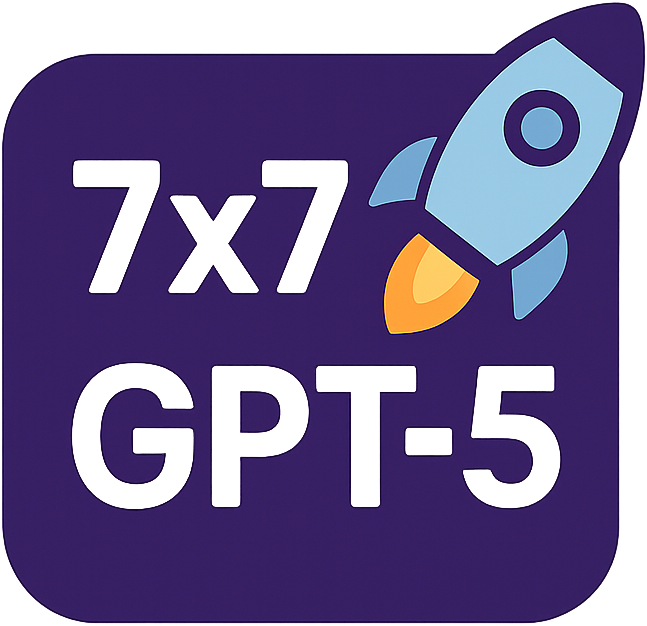

# 7x7\_49天 Vibe Coding 挑戰 🚀

## 專案簡介

**7x7 49天每天用 GPT-5 寫個有趣或有用的應用**
這是一個自我挑戰計劃：連續 **7 週 (49 天)**，每天都與 GPT-5 協作，開發一個小型應用。
應用形式不限，可以是有趣的玩具、也可以是實用的小工具，重點在於 **持續探索人機協作的可能性**。

## 為什麼要做這個挑戰？

每隔一段時間，我就會想要脫離舒適圈，挑戰一些超越自身能力的事情：

AI 的出現讓我們的大腦似乎有變得安逸的風險，但我並不這麼認為。
在人機協作的過程裡：

* **人類提需求**
* **AI 給出超越預期的解法**

這不只是「使用工具」，而是一種 **雙贏的共同進化**。

幾天前，我第一次見識到 GPT-5 的能力。當時我隨口提了一個需求，它便為我寫出一個單頁 HTML 的 **3D 運鏡模擬器**。
那一刻我感受到 —— 人機協作正在進入全新模式。

因此，我決定開始這個 7x7 挑戰，讓 GPT-5 成為我的開發夥伴。

## 挑戰規則

1. 持續 49 天
2. 每天完成一個應用
3. 每個應用必須由我與 GPT-5 協作完成
4. 作品可以小巧，但必須有「趣味性」或「實用性」

## 挑戰目標
* 探索 AI 輔助開發的極限
* 訓練持續創作與學習的肌肉
* 建立一個 **49 個 AI 應用的作品集**
* 與更多人分享「人機協作」的樂趣與價值

## 如何參與

* 你也可以嘗試自己的「7x7 挑戰」，不限應用領域
* 或者在 issue / PR 中提出有趣的點子，我會嘗試用 GPT-5 一起實作

## License

MIT License

